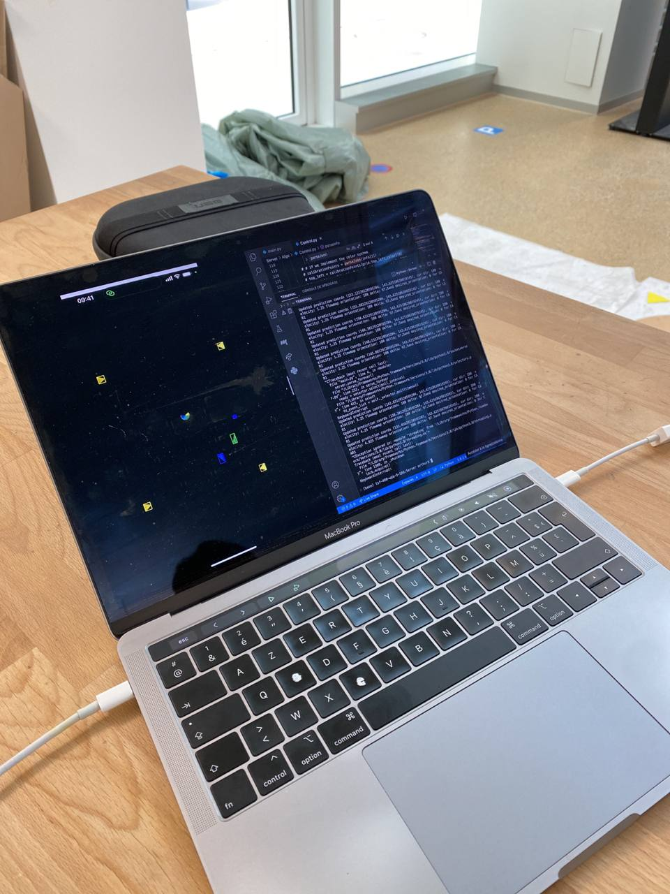
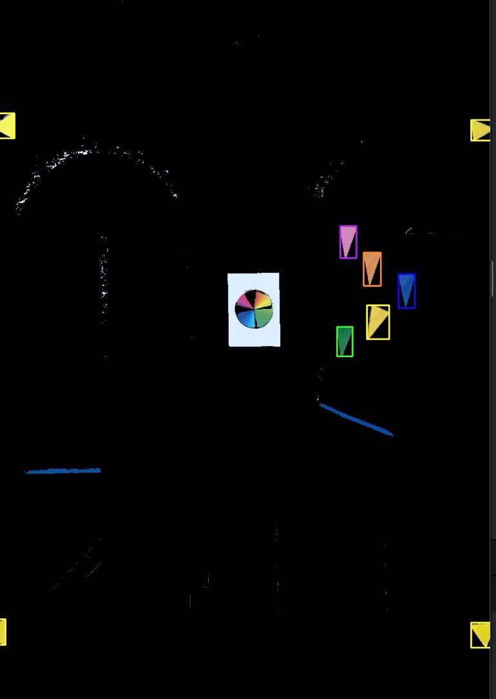

# iOS Application for Cars Detection

We needed a robust, latency-free car detection and coordinate system to feed the server to complete this project. We decided to go with what we had on hand, and use one of our phones to do the job. So we developed an iOS application in Swift and C++ (because we had to bridge OpenCV in C++, as a Swift version didn't exist).

Our first approach was to use machine learning to recognize the cars, but we quickly abandoned this idea as it was complicated to set up a model that corresponded to our cars, and the results were not very convincing.

So we turned to OpenCV, an open source computer vision library, for this task. As the library offers efficient tools for keeping only a particular range of colors and detecting shapes, it was perfect for our case.

### Reliable Coordinate System

The first challenge was to establish a reliable and precise coordinate system, which initially stymied us because we hadn't taken into account the distortion created by the phone's lens. 

 

  

Fortunately, OpenCV makes it easy to correct this distortion, and the hardest part was calibrating the camera and finding its distortion coefficients. For those curious about this, the [OpenCV Calibration](https://docs.opencv.org/4.x/dc/dbb/tutorial_py_calibration.html) page is very well documented.

  

### Calibrating the circuit

Once we had a reliable coordinate system with lens distorsion corrected, the next step was to calibrate our circuit properly. 

When launched, the application launchs in calibration mode. To calibrate the circuit properly, we chose to place a triangle in each corner of the circuit (yellow equal-sided triangle here). The coordinates of these 4 triangles are sent to the server so that it can match the coordinates in the flow map with the coordinates sent by the application.

Here's the technical process for detecting yellow triangles: 
- Request a new image from the iPhone camera.
- Transform it into the OpenCV image format (Mat format) and un-distort it (correct for lens distortion).
- Apply a yellow filter to retain only the yellow elements of the image.
- Perform shape detection on the image and keep only the triangles.
- Obtain the center of each triangle in the iOS coordinate system.
  
If we detect exactly 4 triangles and the positions have been the same for 5 seconds, we send these positions to the server.

Once the server has confirmed that it has received the positions, the application switches to car detection mode. The application also retains the points it used to calibrate, so that any potential false positives outside the rectangle formed by the calibration points are filtered out and not sent to the server.

  

### Detecting cars and their orientation

Now that the server is calibrated and we have our coordinate system, we just need to detect the cars and their orientation.

We therefore decided to equip each car with an isosceles triangle of a very distinct color. The isosceles triangle because a triangle is one of the least common shapes in a commonplace environment, and isosceles to detect the orientation of the car. The orientation detection works as follows: we detect the triangle, then its smallest side, we then draw a perpendicular to the center of its smallest side, which allows us to find the car's orientation in degrees using basic math.

Here's the technical process for detecting cars and their orientation:
- Request a new image from the iPhone camera.
- Transform it into the OpenCV image format (Mat format) and un-distort it (correct for lens distortion).
- For each car's color:
  - Apply a color filter to retain only the elements of the car's color in the image.
  - Perform shape detection on the image and keep only the triangles.
  - Obtain the coordinates of the intersection of the two longest sides of the isocele triangle, which we'll use as the car's coordinate. 
  - Identify the smallest side and draw a perpendicular to its center to obtain the orientation of the car (0-360 degrees).
- Send to the server the position of each car and its orientation.

  

### Performance

In terms of performance, the application was able to recalculate car positions and orientations and send them to the server 10 to 15 times per second.

### Potential Drawback

One drawback is that to avoid false positives, the color calibration had to be very precise, and is only accurate for a certain time slot (depending on the amount of sunlight entering the building where we calibrated it). As a result, there were occasional false positives on certain colors, particularly in the evening when there was no sun. This can of course be adjusted by recalibrating.

